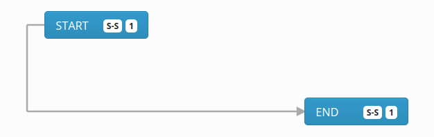

# NgLinks
Simple and fast linking module for Angular.

## Demo

Here you have some demo links. You can check performance for 100, 1000, 10000 and 10000 rendered links. 
In browser console you will find logged render time for each operation. 

Remember, visible endpoints and drag and drop are not part of `ng-links` and it's far from high performance solution. 

[Basic example](https://galczo5.github.io/ng-links/) - four link types with endpoints and drag and drop

[100 links with endpoints](https://galczo5.github.io/ng-links/?count=100) 
or 
[100 links without endpoints](https://galczo5.github.io/ng-links/?count=100&noEndpoints=true)

[1000 links with endpoints](https://galczo5.github.io/ng-links/?count=1000) 
or 
[1000 links without endpoints](https://galczo5.github.io/ng-links/?count=1000&noEndpoints=true)

[10000 links with endpoints](https://galczo5.github.io/ng-links/?count=10000) 
or
[10000 links without endpoints](https://galczo5.github.io/ng-links/?count=10000&noEndpoints=true)

[100000 links with endpoints](https://galczo5.github.io/ng-links/?count=100000)
or
[100000 links without endpoints](https://galczo5.github.io/ng-links/?count=100000&noEndpoints=true)

## Install
npm module soon

## Docs
Docs are available [here](./projects/ng-link/README.md)

## Contribution
Leave issue or something

## License
MIT
